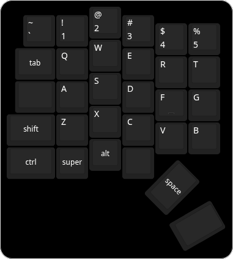
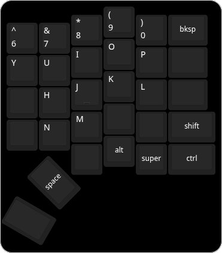

# Split Keyboard

Open source keyboard software to be used in conjunction with CircuitPython on Raspberry Pi Picos.  
The `lib/common/kboard.py` is all you need to get started but the split functionality comes from `lib/common/klink.py`.  
have a look at the `controller` directory in `src` to get an understanding of how its meant to come together.

# Implementation
## Design
The design is two Raspberry Pi Picos hooked up to 30 buttons each (5 x 6) and connected together through a 3.5mm TRRS connection holding UART.

### Left Side
Left side is just a button panel and it sends its presses through the UART connection to the main board.

### Right side
Right side is the main board that takes all button presses and the UART connection and translates it into keypresses.

## Hardware
`./gerber/keyboard_comb.zip` is the Right and Left keyboard joined with a perforation to be sent to any PCB maker.
inside is the gerber and drill files needed to make the board.

Required Components:
- 2 * `Raspberry Pi Pico`, one for left other for right
- 1 * `USB C 12 - 16 pin connector` the PCB expects a raised profile with THT sheild pegs
- 1 * `5.1kΩ Resistor` THT expected; to be used for the CC pins on the USB c connection
- 60 * `SMAJ28CA Diodes` or similar profile  
- 60 * `MX Key Switch` up to preference, you can mix and match
- 2 * `PJ320A 3.5mm Female Audio connector`, for the UART connection
- 1 * `'3.5mm TRRS male' to '3.5mm TRRS male' cable` (90° optional) any length will do, try to get around 1".
